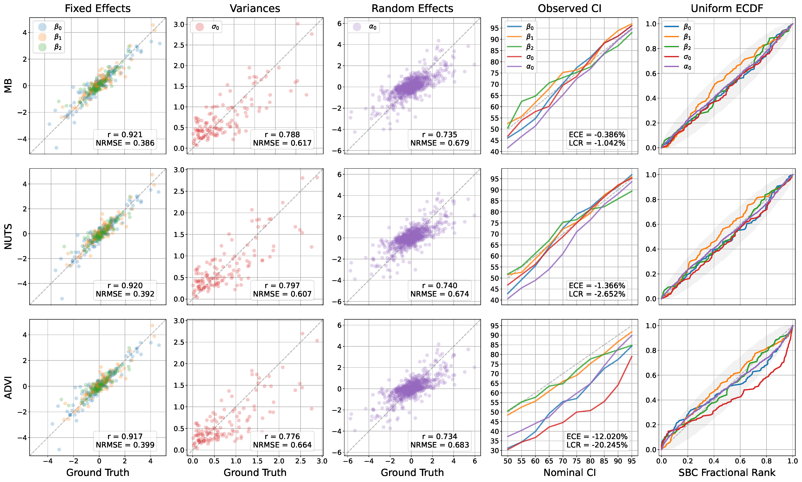

# Rebuttals Figure 1 - Performance for Bernoulli models

Modeling assumption: $y \sim Binomial(1, sigmoid(\eta))$ with $\eta_i = X\beta + Z_i \alpha_i$
Comparison against NUTS and ADVI on semi-synthetic test set (predictors sampled from real datasets, parameters simulated). Columns (from left to right):

(1) Parameter recovery from posterior means (separately for fixed effects, variance parameters, random effects). *r* is the Pearson correlation, *NRMSE* is the normalized root mean squared error (RMSE divided by observed standard deviation of the ground truth parameter).

(2) Posterior coverage plots comparing a range of nominal credible intervals vs. the how often the true parameter is inside the proposed credible interval. *ECE* is the expected coverage error (observed - nominal, averaged over parameters and $\alpha$-levels). *LCR* is the log coverage ratio (log observed/nominal), which is more sensitive to miscalibration at small nominal intervals.

(3) Simulation-based calibration (SCB) check: Comparison of the empirical cumulative distribution (ECDF) of the posterior rank statistic against uniform. The uncertainty envelope gives 95% bounds of ECDFs observable under uniform sampling and use the method proposed by [Säilynoja et al. (2022)](https://link.springer.com/article/10.1007/s11222-022-10090-6).

