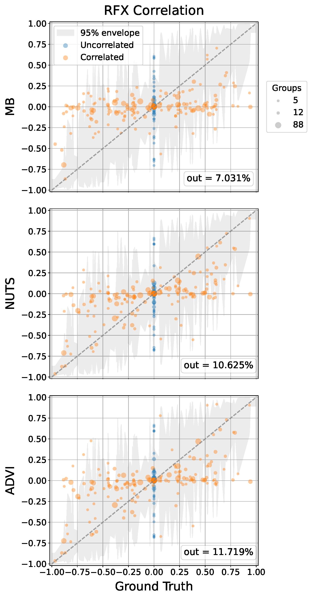

# Rebuttals Figure 3 - Correlated random effects

Recovery of random-effects correlation structure from posterior samples, comparing metabeta, NUTS, and ADVI across datasets with varying numbers of groups $m$ and true pairwise correlations $\rho$.

## Procedure

Results were produced using [`experiments/rfx_corr.py`](../../experiments/rfx_corr.py).

Pairwise posterior correlations are computed from the rfx samples and averaged over the posterior. The mean is plotted against the ground-truth $\rho$. 

The grey band shows a 95% empirical sampling-distribution envelope: because the sample correlation $\hat{r}$ computed from $m$ groups is a noisy estimate of the true $\rho$, a perfect method would still scatter around the diagonal. The envelope makes this irreducible noise explicit and provides a reference for what constitutes genuine bias. It is estimated per unique $m$: for each point on a $\rho$ grid, 2000 bivariate normal samples of size $m$ are drawn, $\hat{r}$ is computed, and the 2.5/97.5 quantiles are recorded; bounds for intermediate $\rho$ values are obtained by linear interpolation. The reported statistic is the fraction of true $\rho$ values falling outside the method's own posterior 95% CI.
