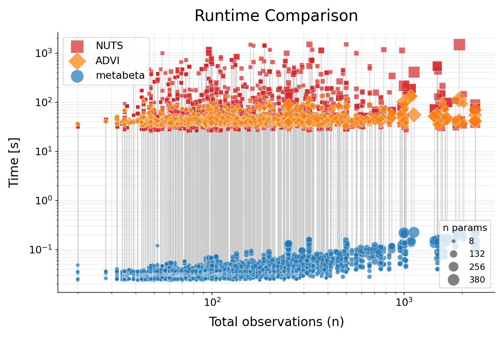

# Rebuttals Figure 4 - Runtime Comparison

Systematic runtime comparison of metabeta, NUTS, and ADVI across 2000+ simulated datasets spanning the full range of $d$, $q$, $m$, and $n$ covered by the [model configs](../../metabeta/models/configs). The effective number of parameters per model is $d + q + m * q + 1$. For scalability, runtimes were produced on a Computer Cluster (GPU: Tesla V100-SXM2-32GB, CPU: Intel Xeon 6248r with 8 Cores).

## Procedure

Runtimes were measured using [`experiments/runtimes.py`](../../experiments/runtimes.py). For each model config × source data config combination:

1. All matching `.fit.npz` test files are discovered and loaded. Individual datasets are padded to the model's maximum dimensions and batched.
2. metabeta inference is run drawing the same number of posterior samples as NUTS/ADVI.
3. NUTS and ADVI runtimes are read directly from the pre-fitted test files (produced by [metabeta/simulation/fit.py](../../metabeta/simulation/fit.py) using bambi/pymc).
4. Per-dataset durations are grouped by source data config and summarized (median, mean, total).

Full results are in [runtimes.md](runtimes.md).
