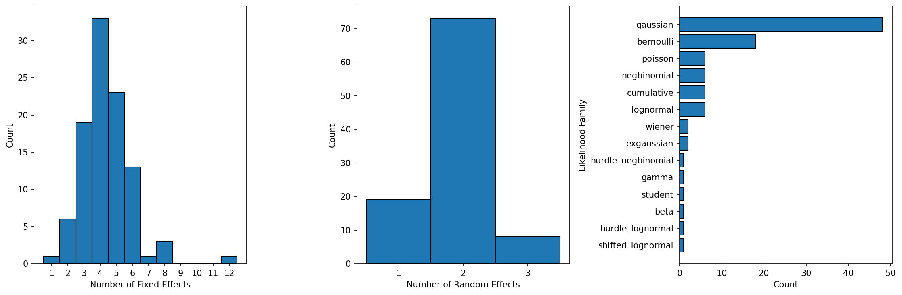

# Rebuttals Figure 5 - Model configurations in published mixed-effects papers

Empirical distribution of Bayesian mixed-effects model configurations reported in 100 published papers, used to ground the simulation ranges for $d$, $q$, and likelihood family.

## Data collection

Papers were identified using the following prompt to Claude:

> I am looking for statistics on brms models used in scientific papers. Please extract how many fixed effects, how many random effects, and which likelihood are used from 100 papers. The papers should come from diverse fields and be published in high quality journals. Produce the output as a csv file. It should be based on real papers (not synthetic).

The resulting [data.csv](data.csv) covers 100 papers across diverse fields (psycholinguistics, ecology, political science, cognitive psychology, and others).

**Disclaimer:** the summary is tentative — a brief check found that Claude reported the wrong year or DOI for a few entries, but all sampled entries exist. We have not verified every paper.

## Summary

- **Fixed effects**: median 4, range 1–12
- **Random-effect grouping factors**: median 2, range 1–3
- **Likelihood families**: Gaussian (48%), Bernoulli (18%), Poisson/negative-binomial/lognormal/cumulative (6% each), and others
