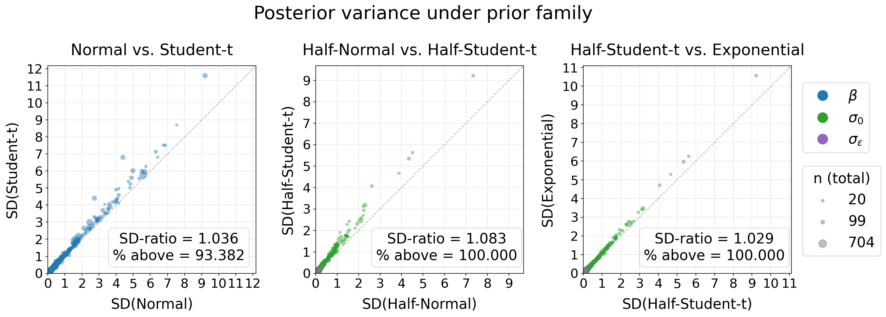

# Rebuttals Figure 6 - Posterior sensitivity to prior family

Verification that the model incorporates prior family information rather than ignoring the family encoding.
A heavier-tailed prior should produce wider posteriors.

## Setup

For each evaluation config, the trained model is run on the test set with the prior family index artificially fixed to each supported family — while keeping all other inputs identical. Posterior standard deviations are compared across families for three parameter groups.

The three panels show pairwise comparisons along the tail-weight ordering:

1. **Normal vs. Student-t** (fixed effects)
2. **Half-Normal vs. Half-Student-t** (variance parameters)
3. **Half-Student-t vs. Exponential** (variance parameters)

The *% above* statistic compares how often the posterior widens due to shifting to a wider-tailed prior family (setting it above the identity line). For this, only points with SD > 1 in the thinner-tailed reference are considered.
